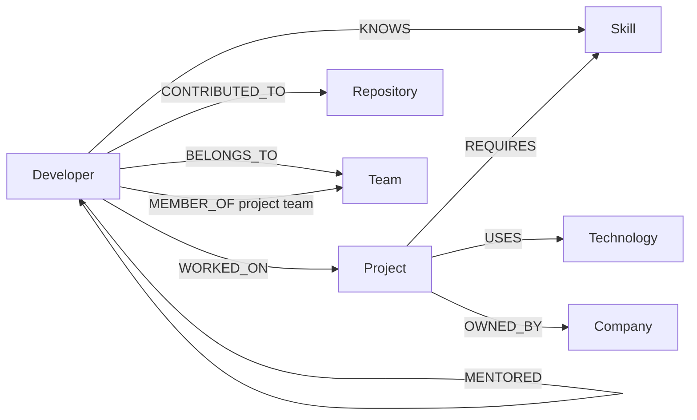
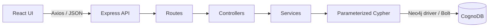

# Developer Knowledge Graph

A small graph-backed application for exploring engineering skills, project work,
repository contributions, and collaboration. It helps an engineering manager
answer practical questions such as who can review a change, who has the skills
for a project, and how two developers have worked together.


## Demo

- **Live application:** `Add deployed frontend URL before submission`
- **API health:** `Add deployed backend URL/api/health before submission`
- **Screen recording:** `Add recording URL before submission`


## Why a graph database?

This application is built around relationships rather than isolated records. A
reviewer recommendation, for example, considers shared projects, repositories,
and technologies. In SQL, those signals usually live behind several junction
tables. The query needs repeated joins, grouping, and separate logic for each
path. Finding an unknown-length collaboration path adds recursive SQL on top.

The graph model stores those connections directly. Cypher follows the same path
an engineering manager has in mind:

```text
(Developer)-[:WORKED_ON]->(Project)-[:USES]->(Technology)
```

That makes multi-hop traversal, `shortestPath()`, and missing-relationship checks
concise. It also keeps reviewer explanations understandable: the API can return
the exact projects, repositories, and technologies behind a score.

CognoDB is appropriate here because it supports openCypher over Bolt and works
with the official Neo4j driver. The project can use familiar graph tooling while
keeping the database managed outside the application.

## Features

### Core Features

- Dashboard with graph totals and popular skills
- Searchable developer directory and connected developer profiles
- Reviewer and project-skill-gap recommendations
- Skill-based developer recommendations for project staffing
- Named project teams saved to CognoDB
- Saved-team dashboard with members and skill coverage
- Interactive knowledge graph with search, filters, zoom, pan, and node details

### Engineering Features

- Parameterized Cypher through the official Neo4j driver
- Fixed query catalog; clients cannot submit raw Cypher
- Deterministic, repeatable seed data
- Shared driver with short-lived read and write sessions
- Consistent validation and error responses, including database outages
- Responsive loading, empty, error, and retry states
- Lazy-loaded Cytoscape bundle

## Technology stack

| Layer | Technology |
|---|---|
| Frontend | React, Vite, Tailwind CSS, React Router, Axios, Cytoscape.js |
| Backend | Node.js 20+, Express, official Neo4j JavaScript driver |
| Database | CognoDB over encrypted Bolt |

## Graph data model



### Node properties

| Label | Main properties |
|---|---|
| `Developer` | `id`, `name`, `email`, `experience`, `designation` |
| `Skill` | `id`, `name`, `category` |
| `Project` | `id`, `name`, `description`, `status` |
| `Technology` | `id`, `name` |
| `Repository` | `id`, `name`, `githubUrl` |
| `Team` | `id`, `name`; saved teams also have `kind`, `requiredSkills`, `createdAt` |
| `Company` | `id`, `name` |

Every label has a unique constraint on `id`.

## Seed dataset

The deterministic seed creates a small but connected engineering organization:

| Data | Count |
|---|---:|
| Developers | 21 |
| Skills | 32 |
| Technologies | 15 |
| Projects | 10 |
| Repositories | 10 |
| Teams | 5 |
| Companies | 3 |
| Seeded relationships | 321 |

These are the initial counts. User-created project teams add `Team` nodes and
`MEMBER_OF` relationships. The seed script uses `MERGE`, so rerunning the same
dataset does not create duplicates.

## Architecture



This is a single frontend and a single backend, not a distributed system. The
frontend never connects to CognoDB. Routes map URLs, controllers validate HTTP
input, services coordinate application logic, and query files contain fixed
Cypher. Database credentials stay in the backend environment.

The backend follows a small route → controller → service → query flow. The
frontend is organized by pages, reusable components, hooks, and API services.
See [PROJECT_STRUCTURE.md](./PROJECT_STRUCTURE.md) for the complete tree.

## Local setup

### Prerequisites

- Node.js 20 or newer
- npm
- A running CognoDB Cloud instance

### 1. Create a CognoDB instance

Provision a CognoDB Cloud `c0` instance and save its URI, username, and password.
The URI normally resembles:

```text
bolt+s://<instance-id>.databases.cognodb.cloud
```

The standard username is `cognodb`.

### 2. Configure and start the backend

```powershell
cd backend
Copy-Item .env.example .env
npm install
```

Edit `backend/.env`:

```env
PORT=5000
CLIENT_ORIGINS=http://localhost:5173
DATABASE_URI=bolt+s://your-instance.databases.cognodb.cloud
DATABASE_USERNAME=cognodb
DATABASE_PASSWORD=your-password
```

Never commit `.env`. The repository's `.gitignore` excludes it.

Seed and start the API:

```powershell
npm run seed
npm run dev
```

Verify it at `http://localhost:5000/api/health`.

### 3. Configure and start the frontend

Open another terminal:

```powershell
cd frontend
Copy-Item .env.example .env
npm install
npm run dev
```

Open `http://localhost:5173`.

## Environment variables

### Backend

| Variable | Required | Example | Purpose |
|---|---|---|---|
| `DATABASE_URI` | Yes | `bolt+s://...` | CognoDB Bolt address |
| `DATABASE_USERNAME` | Yes | `cognodb` | Database username |
| `DATABASE_PASSWORD` | Yes | — | Database password |
| `PORT` | No | `5000` | Express port |
| `CLIENT_ORIGINS` | No | `http://localhost:5173` | Comma-separated allowed origins |
| `NODE_ENV` | No | `production` | Controls safe error output |

### Frontend

| Variable | Required | Example | Purpose |
|---|---|---|---|
| `VITE_API_URL` | No | `http://localhost:5000/api` | Public Express API base URL |

Do not put database credentials in a `VITE_` variable. Vite exposes those values
to browser code.

## API reference

All successful endpoints return a `data` property. Errors return an `error`
object with a readable `message`.

| Method | Endpoint | Description |
|---|---|---|
| `GET` | `/api/health` | HTTP and database readiness |
| `GET` | `/api/dashboard` | Counts and popular skills |
| `GET` | `/api/developers` | All developers |
| `GET` | `/api/developers/:id` | Complete developer profile |
| `GET` | `/api/developers/:id/network` | Developers connected within two hops |
| `GET` | `/api/developers/:id/recommend-reviewers` | Ranked reviewers |
| `GET` | `/api/developers/:id/skill-gaps` | Missing project skills |
| `GET` | `/api/projects` | Projects, companies, and technologies |
| `GET` | `/api/skills` | Skills with developer counts |
| `GET` | `/api/technologies` | Technologies with project counts |
| `GET` | `/api/teams/recommend?skills=React,GraphQL` | Team candidates |
| `GET` | `/api/teams/project-teams` | Saved project teams |
| `POST` | `/api/teams/project-teams` | Create a named project team |
| `GET` | `/api/teams/project-teams/:id` | One saved project team |
| `GET` | `/api/graph/network` | Complete visualization graph |
| `GET` | `/api/graph/developers/:id` | Focused developer graph |
| `GET` | `/api/graph/queries` | Allowed query names |
| `POST` | `/api/graph/query` | Execute a predefined safe query |

Example safe query request:

```json
{
  "queryName": "developersBySkill",
  "parameters": {
    "skillName": "React"
  }
}
```

Raw Cypher is never accepted from an HTTP request.

## Graph Queries Demonstrated

| Problem | Graph concept |
|---|---|
| Find developers by skill | One-hop traversal |
| Find technologies used by a developer | Multi-hop traversal |
| Recommend reviewers | Relationship scoring |
| Find project skill gaps | Negative pattern matching |
| Find a collaboration route | `shortestPath()` |
| Recommend team members | Aggregation |

## Main Cypher queries

All values are passed separately as Neo4j driver parameters. Query strings are
never assembled with user input.

### Find developers by skill

```cypher
MATCH (developer:Developer)-[:KNOWS]->(skill:Skill)
WHERE toLower(skill.name) = toLower($skillName)
RETURN developer, skill
```

### Multi-hop technology traversal

```cypher
MATCH (developer:Developer {id: $developerId})
      -[:WORKED_ON]->(project:Project)
      -[:USES]->(technology:Technology)
RETURN technology, collect(DISTINCT project)
```

This is the required traversal of two or more hops.

### Shortest collaboration path

```cypher
MATCH (start:Developer {id: $startDeveloperId}),
      (end:Developer {id: $endDeveloperId})
MATCH path = shortestPath((start)-[:WORKED_WITH*..10]-(end))
RETURN nodes(path), length(path)
LIMIT 1
```

The maximum of ten hops bounds the work performed by an unexpected request.

### Skill-gap query

```cypher
MATCH (developer:Developer {id: $developerId})
MATCH (project:Project)-[:REQUIRES]->(missingSkill:Skill)
WHERE NOT (developer)-[:KNOWS]->(missingSkill)
RETURN project, collect(DISTINCT missingSkill)
```

This is intentionally awkward in SQL: it requires joining project requirements,
skills, and developer skills, then excluding matching skill rows.

### Explainable reviewer recommendation

Reviewer candidates receive:

- 3 points for each shared project
- 2 points for each shared repository
- 1 point for each shared technology

The API returns both the score and the relationships responsible for it, so the
recommendation can be explained to a user.

### Team recommendation with aggregation

```cypher
MATCH (developer:Developer)-[:KNOWS]->(skill:Skill)
WHERE toLower(skill.name) IN
      [requiredSkill IN $requiredSkills | toLower(requiredSkill)]
WITH developer, collect(DISTINCT skill) AS matchedSkills
RETURN developer,
       matchedSkills,
       size(matchedSkills) AS matchedSkillCount
ORDER BY matchedSkillCount DESC, developer.experience DESC
LIMIT $limit
```

`$requiredSkills` and `$limit` are driver parameters. The query groups matching
skills per developer and ranks the strongest candidates first.

## Error handling

The API returns consistent JSON errors for validation (`400`), disallowed origins
(`403`), missing resources (`404`), database outages (`503`), and unexpected
errors (`500`). When CognoDB is unavailable, `/api/health` reports `degraded`
without exposing driver or credential details.

## Useful commands

Run these from `backend/`:

```powershell
npm run dev             # Start API with automatic restart
npm start               # Start API normally
npm run seed            # Idempotently load sample graph
npm run verify:queries  # Run read-only Cypher checks
npm run verify:api      # Run API smoke checks
```

Run these from `frontend/`:

```powershell
npm run dev      # Start Vite development server
npm run build    # Create production bundle
npm run preview  # Preview production bundle
```

## Deployment

The intended deployment keeps the three application parts separate:

| Component | Suggested host |
|---|---|
| React frontend | Vercel |
| Express backend | Render or Railway |
| Graph database | CognoDB Cloud |

### Backend — Render or Railway

Use `backend` as the service root, `npm install` as the build command, and
`npm start` as the start command. Configure the documented backend variables,
set `NODE_ENV=production`, point `CLIENT_ORIGINS` to Vercel, and use
`/api/health` for the health check.

### Frontend — Vercel

Use `frontend` as the project root and `dist` as the output directory. Set
`VITE_API_URL` to the deployed backend URL ending in `/api`, and configure the
SPA fallback so direct page URLs serve `index.html`.

The database remains in CognoDB Cloud; only its Bolt credentials are configured
on the backend host. After deployment, open a profile through a direct URL—not
only through client-side navigation—to confirm the Vercel SPA rewrite is correct.

## Design decisions and trade-offs

- **REST instead of GraphQL:** the UI needs a small, known set of operations.
  REST keeps the API easy to inspect and explain within the assignment timeframe.
- **React with Vite instead of Next.js:** the application has no server-rendering
  requirement, so a client-side application keeps the data flow straightforward.
- **One Express application:** a monolith is sufficient for this scope. Splitting
  the API into services would add complexity without improving the graph demo.
- **No authentication:** identity and authorization are outside the assignment
  scope. A real internal deployment would add both before allowing writes.
- **Deterministic seed data:** every reviewer sees the same paths and recommendation
  results, making behavior easier to verify and discuss.
- **Separate team relationships:** `BELONGS_TO` is organizational membership;
  `MEMBER_OF` is membership in a project team created through the UI.
- **One shared database driver:** the driver manages connection pooling while
  each operation uses a short-lived session.
- **Fixed Cypher catalog:** predefined parameterized queries demonstrate graph
  traversal without exposing arbitrary database execution.
- **Client-side graph filtering:** it is reasonable for the seeded 96-node graph.
  A larger dataset would need server-side limits and focused subgraph queries.
- **Lazy-loaded Cytoscape:** users do not download the graph engine until a graph
  is displayed.
